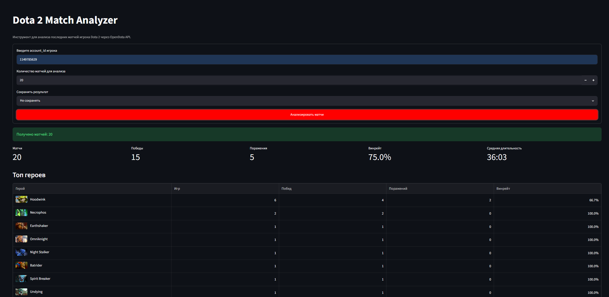
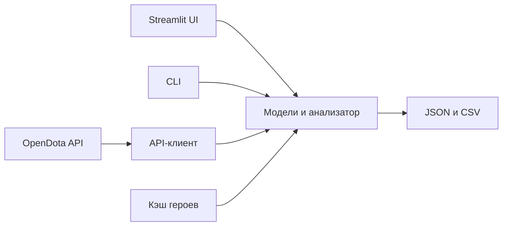

# Dota 2 Match Analyzer

Dota 2 Match Analyzer получает последние матчи игрока через OpenDota и показывает статистику игрового профиля, за выбранное количество матчей: винрейт, среднюю длительность матчей и любимых героев.

Это Python-приложение с консольным и веб-интерфейсом.



## Возможности

- вывод статистики последних матчей по `account_id`;
- статистика побед, поражений и длительности матчей;
- таблицы с именами и иконками героев;
- интерактивные графики по героям;
- сохранение результатов в JSON и CSV;
- работа с локальным кэшем, если OpenDota временно недоступен.

## Технологии


## Запуск проекта

Создание виртуального окружения и установка зависимостей:

```powershell
python -m venv .venv
.\.venv\Scripts\Activate.ps1
python -m pip install -r requirements.txt
```

Запуск приложение:

```powershell
.\run_app.bat
```

После запуска откройте [http://localhost:8501](http://localhost:8501).

Для Linux и macOS:

```bash
python3 -m venv .venv
source .venv/bin/activate
python -m pip install -r requirements.txt
python -m streamlit run app.py
```

## Запуск

| Режим | Команда |
|---|---|
| Веб-интерфейс | `python -m streamlit run app.py` |
| Загрузить матчи | `python main.py fetch 123456789` |
| Выполнить анализ | `python main.py analyze 123456789` |
| Сохранить JSON | `python main.py analyze 123456789 --save json` |
| Сохранить CSV | `python main.py analyze 123456789 --save csv` |

`123456789` нужно заменить на Steam32 `account_id` игрока. Параметр `--limit` меняет число матчей для анализа, например `--limit 10`.

OpenDota endpoint `recentMatches` возвращает до 20 последних матчей. Значение `--limit` больше 20 не добавит более старые матчи.

## Архитектура



## API и данные

| Ресурс | Адрес или путь | Назначение |
|---|---|---|
| OpenDota API | `https://api.opendota.com/api` | Основной API |
| Последние матчи | `/players/{account_id}/recentMatches` | Матчи игрока |
| Герои | `/heroes` | Имена и данные героев |
| Документация API | [docs.opendota.com](https://docs.opendota.com/) | Swagger и подробности методов |
| Кэш героев | `data/heroes.json` | Справочник имен и иконок |
| Сырые матчи | `data/raw/{account_id}_matches.json` | Ответ API |
| Результаты | `data/processed/` | Экспорт JSON и CSV |

При первом запуске справочник героев сохраняется локально. Если имя или изображение недоступно, приложение продолжит работу и покажет `Hero ID`.

## Основные файлы

| Файл | Назначение |
|---|---|
| `app.py` | Streamlit UI |
| `main.py` | CLI-команды |
| `api_client.py` | Получение матчей |
| `heroes.py` | Имена, иконки и кэш героев |
| `models.py` | Модели данных |
| `analyzer.py` | Расчет статистики |
| `storage.py` | Чтение и сохранение файлов |
| `ui_helpers.py` | Таблицы и графики |
